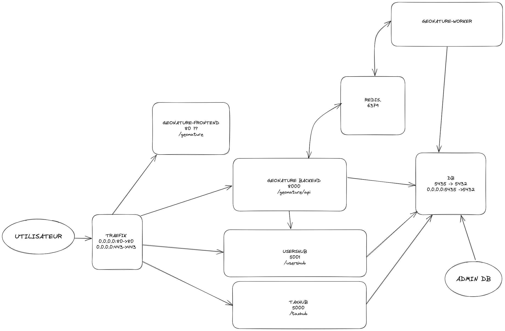

# GeoNature Docker Services

Ce dépôt permet de déployer automatiquement et facilement GeoNature, UsersHub dans un environnement dockerisé et accessible en HTTPS. De plus, celui-ci fournit une image Docker de GeoNature contenant, outre les modules du cœur (Occtax, Occhab, Validation, Import), les modules suivants :

- [Export](https://github.com/PnX-SI/gn_module_exports)
- [Dashboard](https://github.com/PnX-SI/gn_module_dashboard)
- [Monitorings](https://github.com/PnX-SI/gn_module_monitorings)

## Démarrage rapide

- Installer Docker : [voir la documentation](https://docs.docker.com/engine/install/)
- Ajouter votre utilisateur courant au groupe `docker` : `sudo usermod -aG docker $USER` puis réouvrir sa session Linux ([voir la documentation](https://docs.docker.com/engine/install/linux-postinstall))
- Installer `git` (`sudo apt-get install git`)
- Clôner le dépôt : `git clone https://github.com/PnX-SI/GeoNature-Docker-services` ou extraire une [archive](https://github.com/PnX-SI/GeoNature-Docker-services/releases)
- Se placer dans le répertoire du dépôt : `cd GeoNature-Docker-services`
- Créer le fichier `.env` à partir du fichier d’exemple : `cp .env.sample .env`. Compléter les paramètres importants (`HOST`, `ACME_EMAIL`, `GEONATURE_LOCAL_SRID`, `POSTGRES_PASSWORD`, `GID`, `UID`).
- Lancer la commande `./init-config.sh` afin de créer les fichiers de configuration suivants, avec des clés secrètes générées aléatoirement :
  - `config/geonature/geonature_config.toml`
  - `config/usershub/config.py`
- Lancer les conteneurs : `docker compose up -d`

Les logs de tous les services sont accessibles avec la commande `docker compose logs -f`.
Pour n'afficher que les 100 dernières lignes, on utilise l'option `--tail 100` et donc la commande `docker compose logs -f --tail 100`.
Pour n'afficher les logs que d'un service en particulier, on utilise la commande `docker compose logs -f <nom du service>`.

## Les services

- `postgres` : la base de données
- `usershub` : la gestion des utilisateurs
- `geonature-backend` : l’API de GeoNature
- `geonature-frontend` : l’interface web de GeoNature
- `geonature-worker` : exécution de certaines tâches de GeoNature en arrière-plan (import, export, mail, etc...)
- `redis` : service de communication entre le worker et le backend
- `traefik` : serveur web redirigeant les requêtes vers le bon service

```
SERVICE              PORTS
geonature-backend    8000/tcp
geonature-frontend   80/tcp
geonature-worker     8000/tcp
postgres             0.0.0.0:5435->5432/tcp, :::5435->5432/tcp
redis                6379/tcp
traefik              0.0.0.0:80->80/tcp, 0.0.0.0:443->443/tcp, [::]:80->80/tcp, [::]:443->443/tcp
usershub             5001/tcp
```



## Configuration

Voir la documentation des différentes applications pour renseigner les fichiers de configuration :

- GeoNature : `./config/geonature/geonature_config.toml` ([fichier d’exemple](https://github.com/PnX-SI/GeoNature/tree/master/config/geonature_config.toml.sample))
- UsersHub : `./config/usershub/config.py` ([fichier d’exemple](https://github.com/PnX-SI/UsersHub/tree/master/config/config.py.sample))

Ces fichiers doivent contenir _a minima_ le paramètre `SECRET_KEY`.  
Vous pouvez générer automatiquement des fichiers vierges contenant des clés secrètes aléatoires avec le script `./init-config.sh`.

Si vous modifiez les fichiers de configuration de GeoNature, d'un de ses modules, de UsersHub, vous devez relancer les conteneurs Docker avec la commande `docker compose restart` (ou idéalement seulement le conteneur concerné, par exemple `docker compose restart usershub`).

À noter que certaines variables seront fournies en tant que variables d'environnement (voir les fichiers [`.env`](./.env.sample) et [`docker-compose.yml`](./docker-compose.yml)), comme par exemple :

- `URL_APPLICATION`
- `SQLALCHEMY_DATABASE_URI`
- ...

Vous pouvez personnaliser la [politique de redémarrage automatique des services](https://github.com/compose-spec/compose-spec/blob/master/spec.md#restart) en paramétrant la variable `RESTART_POLICY` du fichier `.env` (valeur par défaut: `unless-stopped`)

### Dossiers de configuration et de customisation

- Les fichiers de configuration de GeoNature, de ses modules et de UsersHub sont donc dans le dossier `GeoNature-Docker-services/config/`
- Les fichiers de customisation de GeoNature sont stockés dans le dossier `GeoNature-Docker-services/data/geonature/custom/`
- Les fichiers des médias de GeoNature (photos, application mobile...) sont stockés dans le dossier `GeoNature-Docker-services/data/geonature/media/`

### Configuration par variable d’environnement

Les applications peuvent être configurées par des variables d’environnement préfixées respectivement par `GEONATURE_` et `USERSHUB_` (voir [from_prefix_env](https://flask.palletsprojects.com/en/2.2.x/api/#flask.Config.from_prefixed_env)).  
Ces variables d’environnement doivent être renseignées directement dans le fichier `docker-compose.yml`, bien que certaines variables sont définies à partir d’une variable du même nom en provenance du fichier `.env`.

## Mettre à jour GeoNature et ses modules

- Vérifiez si la [dernière version disponible](https://github.com/PnX-SI/GeoNature-Docker-services/releases) correspond aux versions des applications que vous souhaitez mettre à jour
- Placez vous dans le dossier `GeoNature-Docker-services` de votre serveur
- Mettez à jour le contenu du dossier dans sa dernière version : `git pull`
- Lancez la commande qui va télécharger les dernières versions des différentes applications et les relancer : `docker compose pull && docker compose up -d --remove-orphans`

## FAQ

Pour en savoir plus (lancer des commandes `geonature`, accéder à la BDD, intégrer le MNT, modifier votre domaine,...), consultez la [FAQ](https://github.com/PnX-SI/GeoNature-Docker-services/blob/main/docs/faq.md).

## Images Docker publiées

Une action permet la publication automatique d'images Docker frontend et backend de GeoNature sur [les packages du dépôt](https://github.com/orgs/PnX-SI/packages?repo_name=GeoNature-Docker-services) :

- `ghcr.io/pnx-si/geonature-frontend-extra`
- `ghcr.io/pnx-si/geonature-backend-extra`

Ces images sont le pendant de [celles publiées sur le dépôt de GeoNature](https://github.com/orgs/PnX-SI/packages?repo_name=GeoNature) mais contiennent en supplément les modules externes pré-cités en introduction.

## Liens utiles

## Lancer une instance de développement 
Commencez par vous assurer d'avoir installé make `sudo apt install make`.

Il faut ensuite, dans votre fichier .env décommenter les lignes de l'environnent de dev.

Une fois cela fait, il ne vous reste plus qu'à lancer `make dev`. Selon vos préférences, si la commande 
`make submodule_init` a déjà été lancé une fois, vous pouvez simplement lancer un `docker compose up`.

/!\ Attention pour l'instant, l'instance de développement ne lance en mode dev que le backend, pas le frontend ni 
les autres services. /!\ 

### GeoNature

- [Dépôt](https://github.com/PnX-SI/GeoNature)
- [`Dockerfile` backend](https://github.com/PnX-SI/GeoNature/blob/master/backend/Dockerfile)
- [`Dockerfile` frontend](https://github.com/PnX-SI/GeoNature/blob/master/frontend/Dockerfile)
- [`Dockerfile` backend-extra](./build/Dockerfile-geonature-backend)
- [`Dockerfile` frontend-extra](./build/Dockerfile-geonature-frontend)

### UsersHub

- [Dépôt](https://github.com/PnX-SI/UsersHub)
- [`Dockerfile`](https://github.com/PnX-SI/UsersHub/blob/master/Dockerfile)
