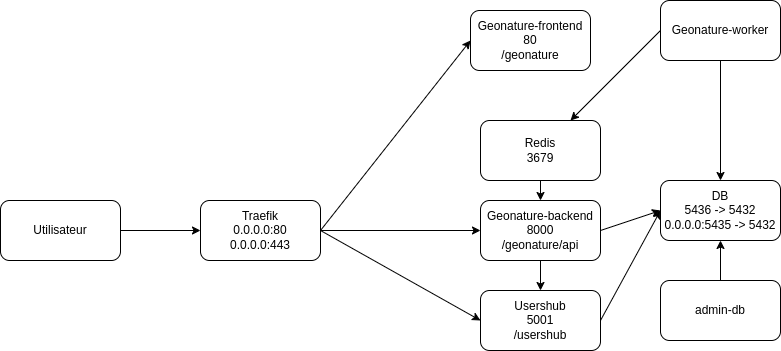

# GeoNature Docker Services

Dockerisation de geonature et d'application associées

## Applications

- backend
    - https://github.com/PnX-SI/GeoNature/blob/master/backend/Dockerfile

- frontend
    - https://github.com/PnX-SI/GeoNature/blob/master/frontend/Dockerfile

- publication
    - https://github.com/PnX-SI/GeoNature/blob/master/.github/workflows/docker.yml

#### UsersHub

- application:
    https://github.com/PnX-SI/UsersHub/blob/master/Dockerfile

- publication:
    https://github.com/PnX-SI/UsersHub/blob/master/.github/workflows/docker.yml


#### TaxHub

- application:
    https://github.com/PnX-SI/TaxHub/blob/master/Dockerfile
- publication:
    https://github.com/PnX-SI/TaxHub/blob/master/.github/workflows/docker.yml


## Commandes


- Pour pouvoir tester GeoNature avec les 4 modules

```
cp .env.dev .env
source .env

# Idéalement ces images seraient publié sur le dépot de geonature
docker build -f Dockerfile-geonature-frontend -t ${GEONATURE_FRONTEND_IMAGE} .
docker build -f Dockerfile-geonature-backend -t ${GEONATURE_BACKEND_IMAGE} .

docker-compose up
```


```
SERVICE              PORTS
geonature-backend    8000/tcp
geonature-frontend   80/tcp
geonature-worker     8000/tcp
postgres             0.0.0.0:5435->5432/tcp, :::5435->5432/tcp
redis                6379/tcp
taxhub               5000/tcp
traefik              0.0.0.0:80->80/tcp, 0.0.0.0:443->443/tcp, 0.0.0.0:8889->8080/tcp, :::80->80/tcp, :::443->443/tcp, :::8889->8080/tcp
usershub             5001/tcp
```




https://excalidraw.com/#json=RWMZ1Hu6RXqGOqjmGlSJX,FqzNr6BRZkkwqD0mll07ig
